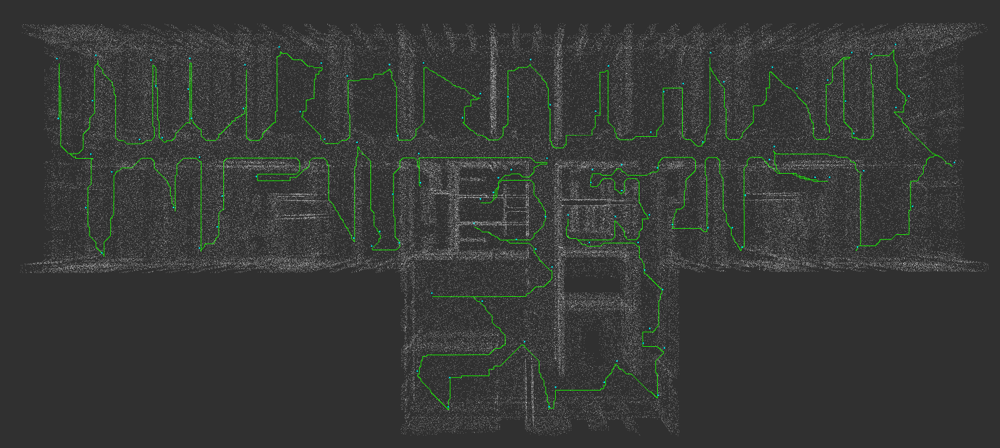

# 3d_coverage_path_planning

Global path planning that generates an optimal path for an autonomous mobile ground robot to cover a prior 3D mesh model with a sensor payload.



Please cite our paper if you use this software as part of your scientific publication:

```
@INPROCEEDINGS{10018726,
  author={Becker, Katrin and Oehler, Martin and Von Stryk, Oskar},
  booktitle={2022 IEEE International Symposium on Safety, Security, and Rescue Robotics (SSRR)}, 
  title={3D Coverage Path Planning for Efficient Construction Progress Monitoring}, 
  year={2022},
  volume={},
  number={},
  pages={174-179},
  doi={10.1109/SSRR56537.2022.10018726}}
```
* [IEEE Xplore](https://ieeexplore.ieee.org/document/10018726)
* [arXiv](https://arxiv.org/abs/2302.00968)


<br><br>

## Data directories <a name="data_directories"></a>

#### Models and path
The directory containing the model and the path can be given in the parameter "/three_dimensional_coverage_path_planning/model/data_directory". This directory needs too be writable, as here also the different model representations are stored. It is also possible to pass absolute paths for the model files.

#### Recorded data
The recorded data are stored in the directory given in the parameter "/three_dimensional_coverage_path_planning/data_recording/recorded_data_directory".


<br><br>


## Precomputations
In the precomputations the viewpoints and the path is computed. The information are stored and loaded when the path shall be executed. In this way, the same path can be executed multiple times.

#### Prepare precomputations
The preparations are not always necessary(e.g. if nothing changed in configuration or model).

* Convert mesh file to hdf5 using `lvr2_hdf5_mesh_tool -i <file>.ply -o <file>.h5`.
* Adapt parameters, see [here](#new_model)

#### Run precomputations <a name="precomputations"></a>
1. Load behavior "three_dimensional_coverage_path_planning_precomputations" in FlexBE.
2. Launch file
    * "precomputations_sim_or_robot_three_dimensional_coverage_path_planning.launch" (if simulation or robot is running and connected)
    * "precomputations_no_robot_three_dimensional_coverage_path_planning.launch" (if no simulation or robot is running)
3. Start execution in FlexBE.


<br>

## Execution of path
Here a precomputed path is loaded and executed. During the execution, the path is updated if obstacles occure. Each time a waypoint is reached, the data recoding is started, e.g. the point cloud is recorded and accumulated to a model.

#### Run execution of path  <a name="execution"></a>
1. Load behavior "three_dimensional_coverage_path_planning_execution" in FlexBE.
2. Launch file:
    * "sim_three_dimensional_coverage_path_planning.launch" (with rviz)
    * "execute_three_dimensional_coverage_path_planning.launch" (without rviz)
3. Start execution in FlexBE.


<br><br>

## Adapt configuration for a another model: <a name="new_model"></a>

The following parameters may need to be changed (in "model" namespace, unless otherwise specified):

* complete_mesh_path:
    * absolute or relative path (see ["Data directories"](#data_directories)) to complete model file
    * OBJ or PLY file (maybe also other format may work, only tested for these)
* target_mesh_path: see complete_mesh_path, for target model
* voxel_size: used for all models that do not have overridden it in their own namespace
* Model specific parameters:
    * Point cloud (complete + target!): num_sample_points, voxel_filter_leaf_size
    * SDF: use_tsdf, fill_inside, floodfill_unoccupied, truncation_distance, slice_level
* Candidate generation (namespace "viewpoint_computation"):
    * percentage_candidates_to_keep
    * cost_threshold
    * start_point_for_iter_vertices
* Mesh Navigation Path planner (namespace waypoint_order_computation):
    * cost_limit
* Mesh Map (top level namespace):
    * mesh_file
    * mesh map parameters


<br>

## Adapt configuration for another robot: <a name="new_robot"></a>

The following parameters may need to be changed:

* Self filter / robot body filter configuration
* base_frame (top level namespace)
* sensor_frame (top level namespace)
* robot_length / width (top level namespace)

<br>

## Adapt configuration for another sensor: <a name="new_sensor"></a>

If it is a new type of sensor, a new data recoder plugin as subclass of DataRecorderBase needs to be implemented.

Additionally, the following parameters may need to be changed:

* data_recorder_plugin: the plugin to be used
* field_of_view (namespace viewpoint computation): horizontal and vertical FOV of sensor as min/max in range [-180, 180] (used for visibility checks)
* min_/max_range (namespace viewpoint computation): minimum and maximum range of sensor (used for visibility checks)
* sensor_frame (top level namespace)


<br><br>


## Record model, compute plan and execute it

### 1. Prepare recording of model
* Version 1: Model from point cloud:
    1. Set `$hector setup set env HECTOR_USE_POINTCLOUD_ACCUMULATOR true`.

* Version 2: Model from voxblox:
    1. Adapt launch file hector_sensor_proc_launch/launch/voxblox.launch:
        * tsdf_voxel_size = 0.1
        * mesh_filename = "file_name"
    2. Start launch file, otherwise here no mesh is generated.


### 2. Record model
* Drive around to record data. Make sure that the environment can be seen completely enough, e.g. drive not too fast and turn around at start/end/corners.
* **Do NOT stop simulation / switch off robot! Otherwise the transformation world-frame to building-frame would not be valid anymore.**
* Save model:
    * Version 1: Save point cloud using `$rosservice call /pointcloud_accumulator_node/save_pointcloud  {"file_path: '<file_path>', file_name: '<file_name>.ply'"}`
    * Version 2: Save voxblox mesh using `$rosservice call <...>/generate_mesh ...`

### 3. Postprocess recorded model
* Version 1: from point cloud:
    1. Clean up point cloud:
        1. Open ply file in MeshLab.
        2. Use "Select vertices" and "Delete vertices" to clean up point cloud. (Show bounding box to make outliers more visible.)
        3. If there are too many vertices, it might be helpful for the surface reconstruction to filter the points. For this purpose, use "Filters > Sampling > Point Cloud Simplification" and select an appropriate number of samples or radius. Apply.
        4. Use "Export Mesh as", enable "Color" and "Normal" and disable "Binary encoding"
        5. Repeat if required.
    2. Mesh point cloud:
        1. Open cleaned ply file in MeshLab.
        2. Open "Filters > Remeshing, Simplification and Reconstruction > Surface Reconstruction: Ball Pivoting".
        3. Adapt Pivot Ball Radius (e.g. use 0.1 or 1.0%). Apply and wait.
        4. "Export Mesh as", enable "Color" and "Normal" and disable "Binary encoding".
* Version 2: from voxblox mesh:
    1. Voxblox stores its meshes in parts (voxel blocks?) that are not connected. I.e. the mesh cannot be used directly. (If used directly, only few candidates can be generated with iter from start method and no paths can be computed).
    2. Cleanup mesh:
        1. Open ply file in MeshLab.
        2. Use "Select vertices" and "Delete vertices" to clean up the mesh.
        3. Use "Export Mesh as", enable "Color" and "Normal" and disable "Binary encoding".
    3. Remesh:
        1. Open ply file in MeshLab.
        2. Select "Filters > Remeshing, Simplification and Reconstruction > Remeshing: Isotropic Explicit Remeshing".
        3. Set Target length and Max. Surface Distance (e.g. 0.14 in world unit or 0.5%). Apply.
        4. Use "Export Mesh as", enable "Color" and "Normal" and disable "Binary encoding".


### 4. Precomputations
1. Prepare precomputations:
    1. Copy mesh file in data directory.
    2. Convert to hdf5 file using `lvr2_hdf5_mesh_tool -i <file>.ply -o <file>.h5`.
    3. Adapt configuration:
        1. Change file names in config/model/general.yaml and config/mesh_nav_map.yaml
        2. Set reachable start point in config/viewpoint_computation/mesh_navigation_candidate_generation.yaml
        3. Probably set cost thresholds in config/viewpoint_computation/mesh_navigation_candidate_generation.yaml and config/waypoint_order_computation/mesh_nav_planner.yaml
2. Run precomputations:
    * See ["Precomputations"](#precomputations)
    * Check models, especially the SDF! If necessary, do not use the SDF check (comment out in config/viewpoint_computation/general.yaml).
    * Check the mesh map, probably adapt the cost thresholds and the start point and start again (see prepare).


### 5. Execution
1. Execute path:
    * See ["Execution"](#execution)
    * Maybe reset map and trajectory etc.
2. Check if recorded model has been stored! Otherwise call `$rostopic pub /three_dimensional_coverage_path_planning/finish_execution_of_path/goal`.

<br><br>


## Troubleshooting
* `Mesh display: no visual available, can't draw mesh! (maybe no data has been received yet?)`
    * MeshMap was activated in rviz, but not published yet
* `Received vertex costs, but UUIDs dont match!`
    * MeshMap was published in an updated version than earlier. This message stops after activating MeshMap in rviz once.
